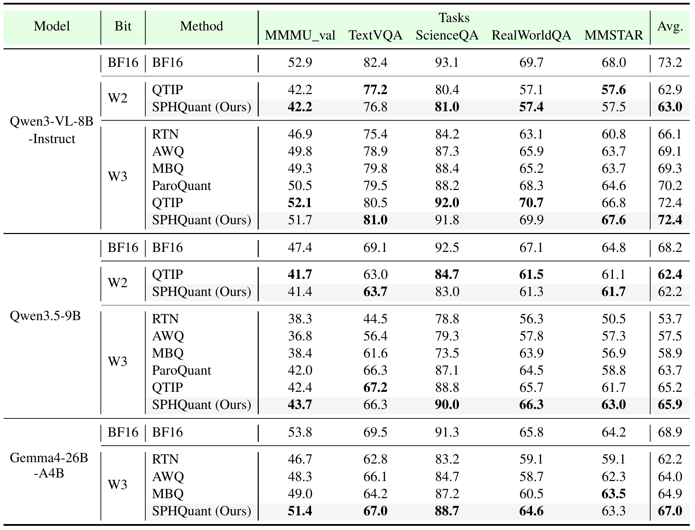

# [NeurIPS 2026] SPHQuant: Efficient extreme low bit weight quantization for Vision-Language Models

[Kewei Zhang](https://github.com/Pushazf), [Zheng Chen](https://zheng-chen.cn/), [Haotong Qin](https://htqin.github.io/), and [Yulun Zhang](https://yulunzhang.com/), "SPHQuant: Efficient extreme low bit weight quantization for Vision-Language Models", NeurIPS 2026

<div>
<a href="https://visitor-badge.laobi.icu/badge?page_id=Pushazf/SPHQuant" style="text-decoration: none;">

</a>
<a href="https://github.com/Pushazf/SPHQuant/stargazers" style="text-decoration: none;">

</a>
<a href="https://arxiv.org/abs/2609.24875" style="text-decoration: none;">

</a>
</div>

---

> **Abstract:** Recent foundation models are moving toward native multimodal Vision-Language Models (VLMs), making VLMs a central form of next-generation foundation models. However, their large language backbones make edge deployment difficult due to high memory footprint and memory-bound autoregressive decoding. Weight-only post-training quantization is a practical solution, but pushing VLMs to extreme low bit-widths remains challenging: existing rotation-free methods suffer from outliers at 2–3 bits, while rotation-based methods improve accuracy at the cost of additional runtime overhead. We propose SPHQuant, a rotation-free spherical weight-only quantization framework for VLMs. Instead of quantizing weights directly in Cartesian coordinates, SPHQuant decomposes each 8D weight vector into coordinate signs, radius, and a positive unit direction. This representation isolates outlier magnitude into the radius while keeping directions bounded and statistically regular. Based on this insight, SPHQuant allocates extra precision to the radius to mitigate accuracy degradation induced by outliers. It further uses a compact positive-direction codebook and fine-tunes codebook entries through angular parameterization to preserve the unit-sphere constraint. We also design a hardware-friendly GEMV kernel that keeps the direction codebook small enough for shared-memory lookup and packs radial bits efficiently. Experiments show that SPHQuant matches the performance of state-of-the-art extreme low-bit quantization methods while improving decode throughput over QTIP by **30.3%** on RTX A6000.

---

### Overview


### Results

SPHQuant achieves competitive accuracy across three recent VLMs at extreme low bit-widths.

<details open>
<summary><strong>Accuracy on VLM Benchmarks</strong></summary>

<p align="center">
  <a href="assets/main_results.png">
    
  </a>
</p>

</details>

## 🔖 To Do

- [x] Add the paper and arXiv links.
- [ ] Release calibration, quantization, and CUDA inference code.
- [ ] Release 2-bit quantized model weights.
- [ ] Release evaluation scripts and reproduction instructions.

## <a name="citation"></a>📎 Citation

If you find this work useful, please cite [our paper](https://arxiv.org/abs/2609.24875).

```bibtex
@inproceedings{zhang2026sphquant,
  title={{SPHQuant}: Efficient extreme low bit weight quantization for {Vision-Language Models}},
  author={Zhang, Kewei and Chen, Zheng and Qin, Haotong and Zhang, Yulun},
  booktitle={NeurIPS},
  year={2026},
  url={https://arxiv.org/abs/2609.24875}
}
```
